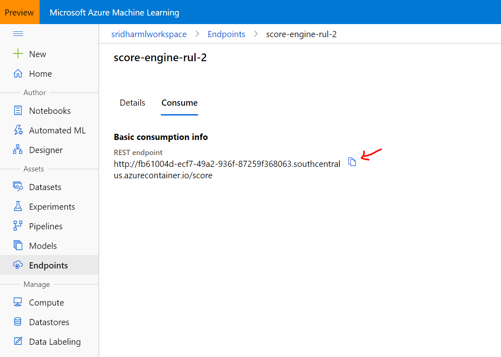

## Aircraft engine remaining useful life (RUL) model building example 

#### Raw data
Below is the Aircraft engine RUL raw dataset:
1. [PM_train.txt](./data/aircraft-rul/PM_train.txt)
2. [PM_test.txt](./data/aircraft-rul/PM_test.txt)
3. [PM_truth.txt](./data/aircraft-rul/PM_truth.txt)

#### Building the predictive table
The predictive table is the final dataset that will the used for training and testing the model. The following
notebook has the code that converts the raw data to the predictive table.
[Data preparation aircraft RUL dataset](https://dhanow.github.io/public/aircraft-engine-rul-model.html)

The final data set is available at: [rul-dataset.csv](./data/aircraft-rul/rul-dataset.csv)
Additionally, the above notebook also builds a model. However, we can build the same model using Azure automated ML with 
is a no-code environment.

#### Load the data to Azure automatedML

Note: Make sure to pick the columns that will be used for modeling additionally set the datatype for each column.

#### Create an experiment run and build the model

#### Deploy the best model alternate you can download the best model

#### Consume the model
Once the model is deployed it is exposed as a REST endpoint. The details of the REST endpoint can be found in the 
"Endpoints" blade.

#### Scoring the model
The model can be scored using a REST API.

Using Postman client:

